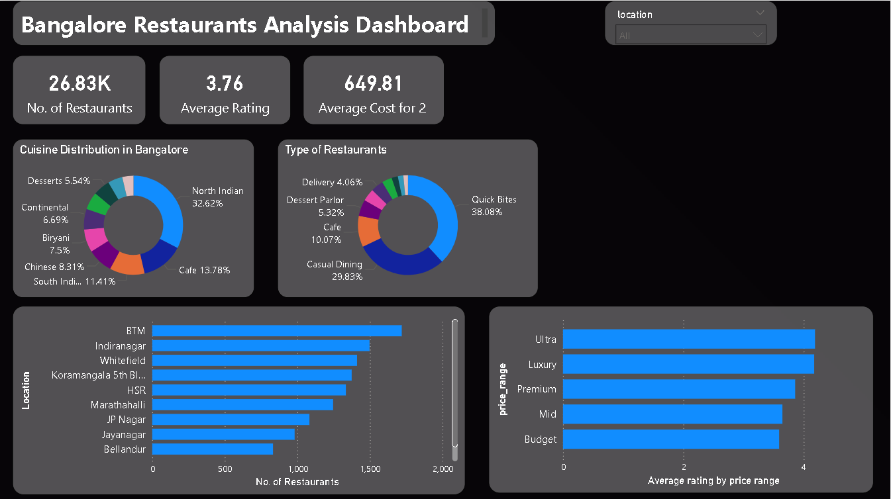

# Zomato Bangalore Restaurant Analysis

## Problem Statement
Analyzed 26,000+ restaurants in Bangalore to identify key factors 
driving restaurant success and help new restaurant owners make 
data-backed decisions.

## Tools Used
- Python (Pandas, Matplotlib, Seaborn)
- Power BI
- Jupyter Notebook

## Key Insights
1. BTM, Indiranagar and Koramangala are most competitive areas
2. Most restaurants rated between 3.5–4.2, aim for 4.0+ to stand out
3. Casual Dining is the most popular and highest rated restaurant type
4. North Indian, Chinese and South Indian are top cuisines
5. Mid range (₹300–600) has the highest number of restaurants
6. Higher price = slightly better rating but quality matters more

## Dashboard Preview

## Dataset Source
[Zomato Bangalore Restaurants - Kaggle](https://www.kaggle.com/datasets/himanshupoddar/zomato-bangalore-restaurants)
